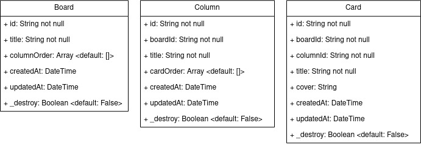
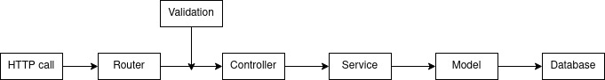

# **trello-api**
Back-end nodejs for the trello-clone project

## **Techologies**
- **Web framework**: [express](https://www.npmjs.com/package/express)
- **Database**: [MongoDB](https://www.mongodb.com/)
- **Database connector**: [MongoDB Nodejs Driver](https://www.npmjs.com/package/mongodb)

## **Schemas structure**

***Note***: *the* **`id`** *field in each schema will be auto-generated by **MongoDB***

## **REST api code flow**

